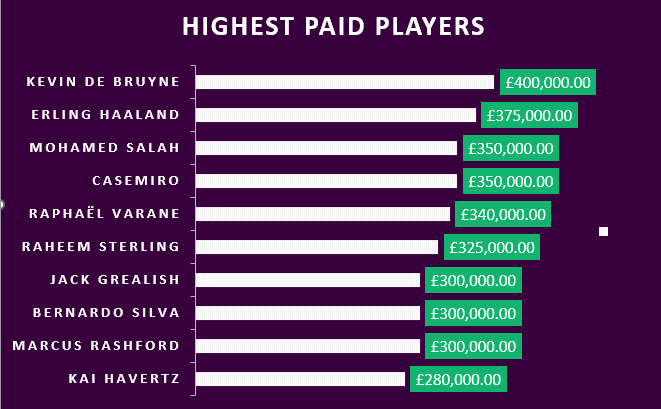

# 2023/2024 Premier League Analysis

## Introduction
This is a data anlysis of the English Premier league.The Premier League is the most-watched sports league in the world. Broadcast in 212 territories to 643 million homes, with a potential TV audience of 4.7 billion people.It is the highest level of the English football league system, contested by 20 clubs on a system of promotion and relegation.  

**_This dataset_** for this study was obtained  from the individual pages of each team from capology.com 

### Problem statement
The main objective of the analysis is to understand the high-earning players, positions earning the highest salaries, the average weekly wage of each team, highest-earning age groups, average age of each team, and the number of players by region in the Premier League.

### Skills and concepts demonstrated:
The following Excel features were incorporated: 
- IF,
- Data cleaning,
- Pivot tables,
- Charts,
- Dashboard.

## Data Analysis and Visualizations

## Highest Paid Players

From the analysis, Kevin De Bruyne, Halaand, Casemiro , Salah , Varane, Sterling , Bernardo Silva, Grealish, Rashford Havertz were the highest paid players in the Premier League. This represents , 4 Manchester city players, 3 Manchester United players, 1 Arsenal, Liverpool and Chelsea player.  

## Salary per position

Supporting strikers (SS) had the highest average salary per week at £102,500 per week followed by Left wingers(LW) at £89,669.80  and Attacking midfielders(AM) at £88,387.50. The least earning positions were Central midfielders (CM) at £51,068.25, Goalkeepers (GK) at £41,250.00, and Right midfielders at £27,500.

Forwards earn £75,872.59 which is £12.255.32 more than the £63,617.27 that defenders earn Midfielders and Goal keepers earn on average , £61,897.95 and £41,250 respectively
Salary by Age class: Further analysis showed the Players within the 30+ class (age 30 and above) earned more overall than players in the other age groups with £74,451.35.
The 30+ players earned £2,219.36 more than players in the '24- 29' age group of £72,231.99. Players in the '18-23' class earned £47,903.53 on average while the only under 18 player earned £5,000.

## Average age per club 

Chelsea has the youngest squad with an averge of 23.1   followed by Burnley with 24.2  and Arsenal at 25.0 . The team with the oldest players are west ham with 27.6 years followed by Fulham with 27.2 and Luton with 27.1

## Number of Players per region

Europeans  dominate,making up 74.5% of the total players in the league with 412 players. South Americans follow with 61 players, comprising 11.03% . Africans make up 9.4% with 52 players. North Americans contribute 13 players, representing 2.35% .The 6 Caribbeans players in the league 1.08% , Asians 0.9% with 5 players , 0.36%  for the Middle east  and Oceania with 2 players each.

# Dashboard

My analysis of the Premier League dataset revealed that footballer’s age and position played are  significant factors in determining the how high they earn. 
